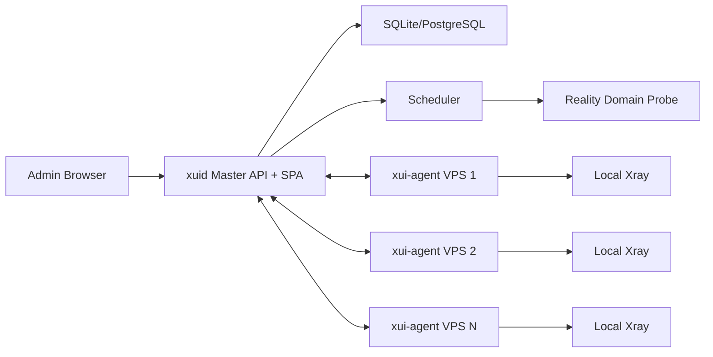

# Architecture

## Upstream Findings

`sing-web/x-ui` is organized as a single Go process:

- `main.go` starts the web server and background jobs.
- `web/web.go` serves Gin routes, embedded HTML templates, assets, i18n, cron
  jobs, and Xray lifecycle tasks.
- `database/model/model.go` stores users, settings, and inbounds in SQLite.
- `web/controller/inbound.go` exposes form-style POST endpoints for inbound
  CRUD, then schedules Xray restart.
- Frontend assets are embedded Vue 2.6 and Ant Design Vue 1.x templates.

This is good for one VPS, but it couples panel state, Xray process control,
templates, and local machine metrics into the same binary. The improved version
splits those concerns.

## Target Topology

## Master Responsibilities

- Authentication, users, audit log.
- Node inventory, tags, regions, health.
- Inbound templates and per-node config rendering.
- Reality domain library, probing, and recommendation API.
- Metrics ingestion and dashboard aggregation.
- Agent enrollment and mTLS/JWT token management.

## Agent Responsibilities

- Register with master using enrollment token.
- Send heartbeat and host/Xray metrics.
- Receive desired Xray config version.
- Apply config atomically and restart Xray.
- Expose no public admin UI by default.

## API Direction

Use JSON REST for the SPA and agent MVP:

- `GET /api/nodes`
- `POST /api/nodes/register`
- `POST /api/nodes/{id}/heartbeat`
- `POST /api/nodes/{id}/desired-config`
- `GET /api/reality/domains`
- `POST /api/reality/recommend`

Later, add WebSocket or Server-Sent Events for live charts and agent streaming.

## Data Model

- `nodes`: id, name, region, endpoint, status, version, last_seen.
- `node_metrics`: node_id, cpu, memory, disk, up, down, xray_state, created_at.
- `inbound_profiles`: protocol, port, security, reality_settings, sniffing.
- `deployments`: node_id, config_hash, status, applied_at, error.
- `reality_domains`: domain, region, category, sni, port, tls_versions,
  success_rate, p50_latency_ms, last_checked_at.

## Security Defaults

- Agents authenticate with short-lived signed tokens after enrollment.
- Master signs desired configs; agents verify before applying.
- Config writes use temp file + fsync + rename.
- Agent command surface is allowlisted.
- Master records audit events for every config deploy and node action.
